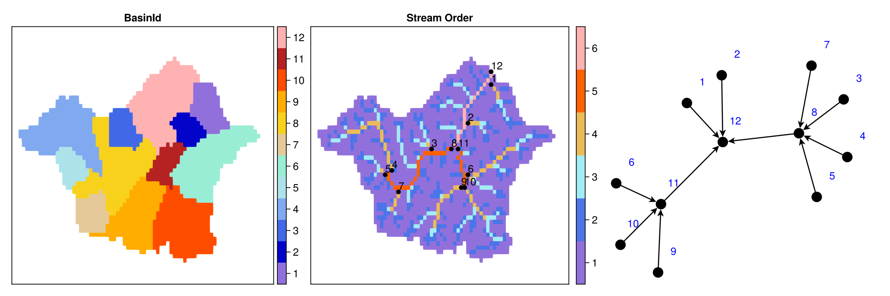

# RiverGraphs

<!-- [](https://jl-pkgs.github.io/RiverGraphs.jl/stable) -->
[](https://jl-pkgs.github.io/RiverGraphs.jl/dev)
[](https://github.com/jl-pkgs/RiverGraphs.jl/actions/workflows/CI.yml)
[](https://app.codecov.io/gh/jl-pkgs/RiverGraphs.jl/blob/main/src)

> Dongdong Kong



```julia
julia> info_node
11×7 DataFrame
 Row │ from   to     value  value_next  length    n_node  index                             
     │ Int64  Int64  Int64  Int64       Float64   Int64   Array…
─────┼──────────────────────────────────────────────────────────────────────────────────────
   1 │  1034   1823     11          12  10.0556       19  [1034, 1098, 1166, 1237, 1310, 1…
   2 │   577   1034     10          11   4.74237      10  [577, 622, 668, 715, 762, 810, 8…
   3 │   576   1034      9          11   4.88558      10  [576, 622, 668, 715, 762, 810, 8…
   4 │  1032   1823      8          12  10.0556       19  [1032, 1098, 1166, 1237, 1310, 1…
   5 │   513   1032      7           8   9.40539      21  [513, 557, 558, 559, 560, 606, 6…
   6 │   716   1034      6          11   3.74381       8  [716, 715, 762, 810, 860, 912, 9…
   7 │   691   1032      5           8  11.4012       25  [691, 692, 645, 600, 556, 557, 5…
   8 │   741   1032      4           8  11.6163       25  [741, 692, 645, 600, 556, 557, 5…
   9 │  1026   1032      3           8   3.02616       8  [1026, 963, 964, 965, 966, 967, …
  10 │  1444   1823      2          12   7.09458      14  [1444, 1443, 1500, 1551, 1597, 1…
  11 │  1776   1823      1          12   1.67579       4  [1776, 1795, 1811, 1823]

julia> info_link
12×6 DataFrame
 Row │ x      y      lon      lat      link   index 
     │ Int64  Int64  Float64  Float64  Int64  Int64 
─────┼──────────────────────────────────────────────
   1 │    27     22  110.81   32.3396      7    513
   2 │    46     23  110.89   32.3437      9    576
   3 │    47     23  110.894  32.3437     10    577
   4 │    23     26  110.794  32.3562      5    691
   5 │    48     26  110.898  32.3562      6    716
   6 │    25     27  110.802  32.3604      4    741
   7 │    37     32  110.852  32.3812      3   1026
   8 │    43     32  110.877  32.3812      8   1032
   9 │    45     32  110.885  32.3812     11   1034
  10 │    48     38  110.898  32.4062      2   1444
  11 │    55     47  110.927  32.4437      1   1776
  12 │    55     50  110.927  32.4562     12   1823
```
